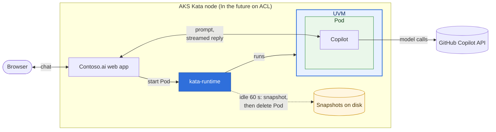
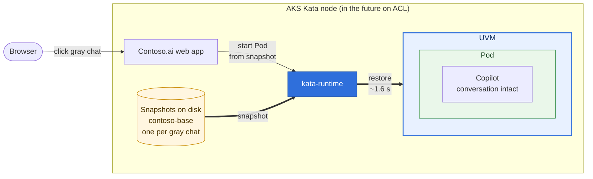
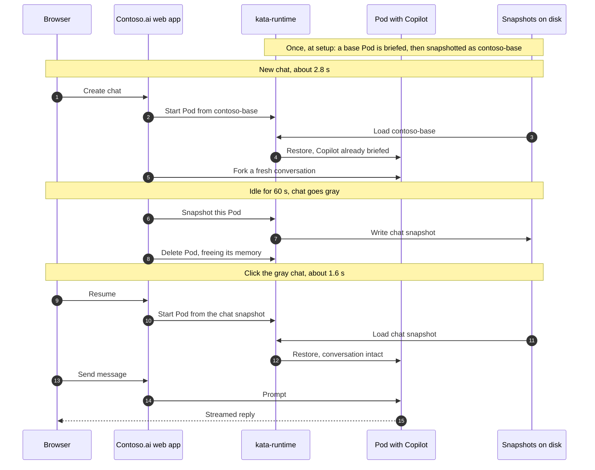

# Contoso.ai demo architecture

Every chat is a Kata Containers Pod on an AKS Kata node. An idle chat is snapshotted
to disk and its Pod deleted, which frees its memory. Clicking the chat again restores
the Pod from the snapshot, with Copilot and the conversation intact. New chats are
restores too, from a pre-briefed base snapshot.

## Components

### Live chat

Each chat is a Pod inside its own UVM (Kata's utility VM), run by a kata-runtime
instance. When the chat goes idle, kata-runtime writes the UVM to disk as a snapshot,
the Pod is deleted, and the chat turns gray. A gray chat has no Pod and uses no memory:
with 5 chats and 1 in focus, only about 0.5 GiB of memory is in use instead of 2.5 GiB.

### Restoring a gray chat

A new kata-runtime instance is fed the chat's snapshot from disk and restores the UVM
where it left off, with the Pod, Copilot, and the conversation already running. New chats
start the same way, from the pre-briefed `contoso-base` snapshot.

## Chat lifecycle

## Where things live

| Piece | Source |
|---|---|
| Dashboard server and session state machine | [server.mjs](server.mjs), [lib/sessions.mjs](lib/sessions.mjs) |
| Pod, snapshot, and restore calls | [lib/k8s-backend.mjs](lib/k8s-backend.mjs) |
| In-VM assistant daemon and demo tools | [agent/assistantd.mjs](agent/assistantd.mjs), [agent/tools.mjs](agent/tools.mjs) |
| Base snapshot build | [setup-base.mjs](setup-base.mjs) |
| Web Deployment, RBAC, Load Balancer | [k8s/web.yaml](k8s/web.yaml) |
| Node agent for `kata-ctl` | [k8s/node-agent.yaml](k8s/node-agent.yaml) |
